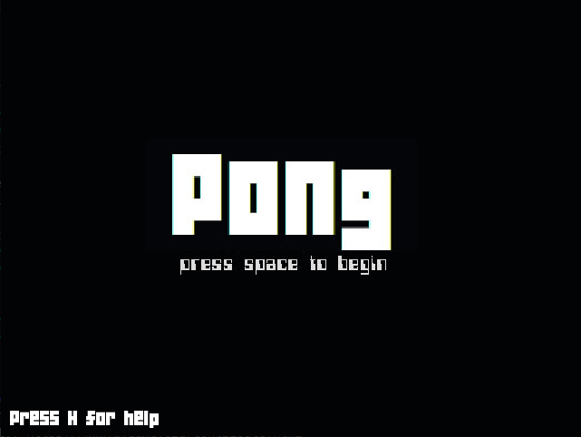
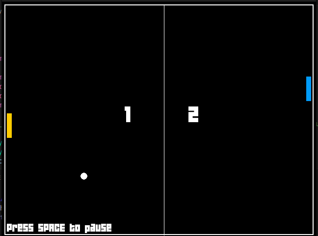
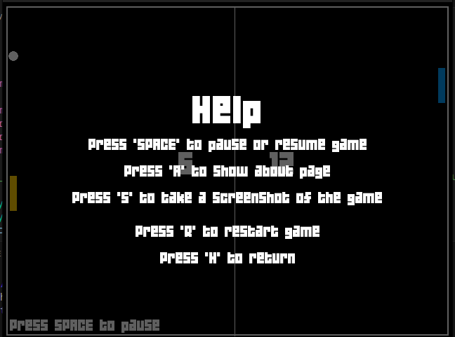

# Pygame-Pong
A simple Pong game designed in Python using pygame


Start screen
<br>


Game play
<br>

<br>
Help screen
<br>

<hr>
<h2>How to play ?</h2>
Install the package pygame
<br>
<br>

```bash
pip install pygame
```
<br>
Clone the repository(git required)

```bash
git clone https://github.com/Tanay-Kar/Pygame-Pong
cd Pygame-Pong
```
OR , download the repository from the top-right code button

<br>
After cloning/downloading repository , run the file 'Pong.py'
<br>


```bash
python3 Pong.py
```
<br>
There are certain keyboard shourtcuts for accessing the different features of the game.
<br>
<li> In the start screen , Press <kbd>SPACE</kbd> to play the game.
<li> Once in the game , you can move your paddle (Blue) using the arrow keys : <kbd>Up</kbd> and <kbd>Down</kbd> keys.
<li> Press <kbd>SPACE</kbd> to pause the game.
<li> Press <kbd>S</kbd> key to take a screenshot of the game window.
<li> Press <kbd>R</kbd> key to restart the game.
<li> Press <kbd>A</kbd> key to show the about page.
<li> Press <kbd>H</kbd> key to show all the keyboard shourtcuts in-game.
<li> Press <kbd>M</kbd> key to mute the game's background song and sound effects.
  
<h2>Have Fun !!</h2>
 
